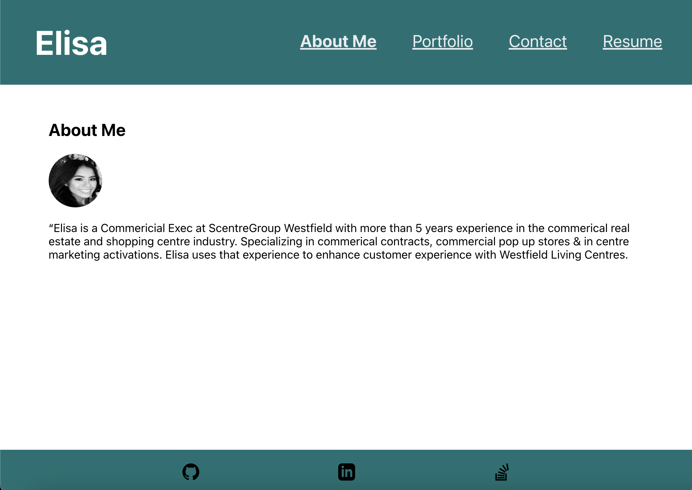

<h1 align="center">
  <br>
Portfolio
<br>

</h1>

<h4 align="center">A professional portfolio created using react <a href="https://react.dev/" target="_blank">React</a>.</h4>

<p align="center">
  <a href="#key-features">Key Features</a> •
  <a href="#how-to-use">How To Use</a> •
  <a href="#download">Download</a> •
  <a href="#credits">Credits</a> •
  <a href="#related">Related</a> •
  <a href="#license">License</a>
</p>



## Key Features

## How To Use

To clone and run this application, you'll need [Git](https://git-scm.com) and [Node.js](https://nodejs.org/en/download/) (which comes with [npm](http://npmjs.com)) installed on your computer. From your command line:

```bash
# Clone this repository
$ git clone git@github.com:ED0920/react-portfolio.git

# Go into the repository
$ cd react-portfolio

# Install dependencies
$ npm install

# Run the app
$ npm start
```

## Credits

This software uses the following open source packages:

- [React](https://react.dev/)
- [Node.js](https://nodejs.org/)
